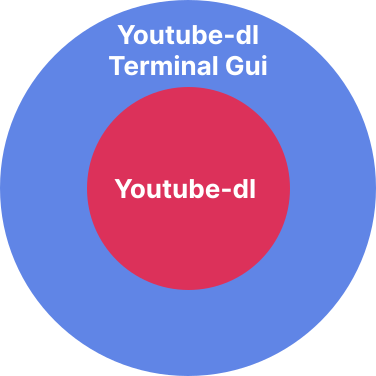

<h1>Youtube-dl Terminal Gui</h1>

Previously called *ytdl-downloader*, youtube-dl terminal gui (or **ytdl-tgui** for short), is a small terminal based gui program that simplifies youtube-dl into a more user-friendly experience for downloading youtube videos and audios in mp4 or mp3 formats. 

The program uses <a href="https://youtube-dl.org/" target="_blank">youtube-dl</a> and <a href="https://ffmpeg.org/" target="_blank">ffmpeg tools</a>, and the .exe version of the program was compiled using <a href="https://pyinstaller.org/en/stable/" target="_blank">PyInstaller</a>.

For more information about any errors you may encounter when using the program, I encourage you go look up the youtube-dl documentation <a href="https://github.com/ytdl-org/youtube-dl/" target="_blank">here</a>, since this program is just superimposed over youtube-dl.
<br>

<h2> Table of contents</h2>

- [How does it work](#how-does-it-work)
- [Installation](#installation)
  - [Install from Source](#install-from-source)
- [Dependencies](#dependencies)
  - [Install dependencies](#install-dependencies)
- [Contributions & Developer note](#contributions--developer-note)
- [License](#license)

<br>

## How does it work
**Youtube-dl terminal gui** is simply a kind of gui wrapper of the youtube-dl command tool. A good way to explain how it works would be like this:

<br>
<div align="center">

</div>

<br>
So basically, any command that works in youtube-dl works on this program too. If you check the .py file, "ytdl-terminal-gui.py", you may find that the program works by simply running youtube-dl commands in the background. As I said, this program is not meant to replace youtube-dl, is simply an extension of it.

<br>

## Installation

### Install from Source

1. Clone the repo into your local machine and open either the .py or .exe file to run the program.

<br>

<div align="center">

</div>

<br>

2. Run the program by:

- running it  with Python:

```bash
# Opens file using your python version
python3 -m location/of/.py/file
```
<br>

- opening it the .exe

```bash
# Opens the file by executing the .exe in the terminal
open location/of/.exe./file
```

<br>


## Dependencies
You need to have youtube-dl and ffmpeg tools installed. Otherwise, both the .py and .exe versions of the program won't work. Also, **youtube-dl terminal gui** is made with Python 3, so be aware the program its imcompatible with older python versions, like Python 2 for example. 


### Install dependencies
You can install *youtube-dl* and *ffmpeg* with pip by running the following commands in the terminal:

```bash
# Installs youtube_dl
pip install youtube_dl
```
```bash
# Installs ffmpeg
pip install ffmpeg
```
<br>

Don't have pip? You can download it by running this command:
<br>
<h3>Linux & MacOs</h3>

```bash
python3 -m ensurepip
```

<h3>Windows</h3>

```bash
py -m ensurepip
```
<br>

You don't have python either? You can download it <a href="https://www.python.org/downloads/" target="_blank">here</a>.

<br>

## Contributions & Developer note
For some reason I don't understand, I cannot get PyInstaller to compile multiple .py files into a single one. So, because of this, I was forced to cram everything into a single .py file. Thus, if you ever look inside the .py file, you are going to find that the code its a complete **mess**. 

I don't know what to do, I'm tired, and for some reason PyInstaller just refuses to work. So, for now, I'm leaving it like that until I find a way how to compile multiple .py into a single .exe.

If by chance you know how to do it, feel free to make a pull request, open a issue, create a discussion, or reach me out, either way I'll be happy for any kind of help regarding this matter. Although, if you want to contribute in other parts of the project, in any way or form, feel free to do so, any kind of help will be gladly recieved 😁.

<br>

## License

[❯ Read the license here →](LICENSE.md) 🔏
