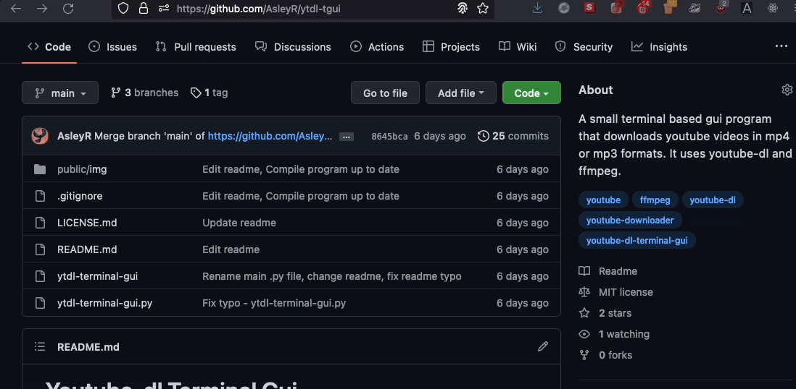

<div align="center">
  
</div>

<br>

YouTer is a small terminal based gui program that simplifies youtube-dl into a more user-friendly experience for downloading youtube videos and audios in mp4 or mp3 formats. There is also an option to enter your own custom youtube-dl commands.

<br>

<h2> Table of contents</h2>

- [Installation](#installation)
  - [Install from Source](#install-from-source)
- [Usage](#usage)
- [Dependencies](#dependencies)
  - [Pip installation](#pip-installation)
- [How does the program work?](#how-does-the-program-work)
- [Contributions](#contributions)
- [License](#license)

<br>

## Installation

### Install from Source

1. Clone the repo into your local machine and _voilá_!

<br>

<div align="center">

</div>

<br>

---

## Usage

There are several ways in which you can open the program.

For instance, you can run the program with python, either by running the `__main__.py` directly, or by running the cloned repo itself.

```bash
# Run __main__.py option
python3 -m __main__.py
```
```bash
# Run the cloned repo folder
python3 ytdl-tgui
```

---

Moreover, there is also the option of compiling the `__main__.py` into an exectubable .exe file using PyInstaller. 

For that, I recommend you read first [the guide](GUIDE-BUILD-EXE.md) on how to build the .exe with PyInstaller.


## Dependencies
YouTer uses the youtube-dl and ffmpeg packages in the background. To install them, you can run the following commands:

```bash
# Installs youtube_dl
pip install youtube_dl
```
```bash
# Installs ffmpeg
pip install ffmpeg
```
<br>

Don't have pip? Scroll down a little to see how to install it.

---
### Pip installation

<h4>Linux & MacOs</h4>

```bash
python3 -m ensurepip
```

<h4>Windows</h4>

```bash
py -m ensurepip
```
Please note that the installation of pip in windows can sometimes be... _complicated_. If you are having problems making pip work, I recommend you this [video guide](https://youtu.be/c_qNC1lL4qA) on how to install it.

<br>

You don't have python either? You can download it from the oficial website <a href="https://www.python.org/downloads/" target="_blank">here</a>.

## How does the program work?
**YouTer** is simply a kind of gui wrapper of the youtube-dl command tool. A good way to explain how it works would be like this:

<br>
<div align="center">

</div>

<br>

So basically, any command that works in youtube-dl works with this program too. If you check the `__main__.py` file, you may find that **YouTer** works by simply running youtube-dl commands in the background.

That's why there's an option inside the program to enter your custom youtube-dl commands, for those who want more control over the output command.

## Contributions
Any type of contributions are welcome! Please read the [contribution guidelines](CONTRIBUTING.md) first before all.

## License

[❯ Read the license here →](LICENSE.md) 🔏
