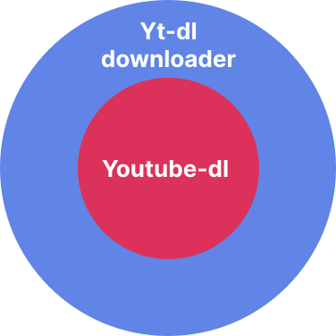

# ytdl-downloader
A small terminal based gui program that downloads youtube videos in mp4 or mp3 formats. It uses <a href="https://youtube-dl.org/" target="_blank">youtube-dl</a> and <a href="https://ffmpeg.org/" target="_blank">ffmpeg tools</a>. The .exe version of the program was compiled using <a href="https://pyinstaller.org/en/stable/" target="_blank">PyInstaller</a>.

For more information about any errors you may encounter when using the program, I encourage you go look up the youtube-dl documentation <a href="https://github.com/ytdl-org/youtube-dl/" target="_blank">here</a> since this program is just superimposed over youtube-dl.


[Developer note](#contributions--developer-note-😐) 🖋

<br>

## Why should I use this?
To be honest, you don't really need to. The youtube-dl command tool can pretty much achieve everything this program can, however, this program is not meant to replace youtube-dl.

So, *"why should I use this?"* you may ask. Well, if you know youtube-dl commands by heart, you don't really need this program, but for those who are not familiar with the youtube-dl command tool, and for those who wake up tired after an 8 hour coding session and want to download something quick, this program is meant for you. 

Yt-dl downloader simplifies each step of the download for a more user-friendly experience so you don't screw up badly and end up downloading *never gonna give you up* in 144p who knows where.

In the future, I plan on adding an option to allow you to input your own youtube-dl commands inside the program; a feature I believe some of you will be glad it exist. Although, you know, if you ever feel limited by the constraints of thi program, you can always hope back to using youtube-dl in the terminal.

## How does it work
Yt-dl downloader is simply a kind of gui wrapper of the youtube-dl command tool. A good way to explain how it works would be like this:

<br>
<div align="center">

</div>

<br>
So basically, any command that works in youtube-dl works on this program too. If you check the .py file of yt-dl downloader, you may find that the program works by simply running youtube-dl commands in the background. As I said, this program is not meant to replace youtube-dl, is simply an extension of it.

<br>

## How to use it 🤷‍♂️
There are two ways to open the program:

1) Via python

```bash
# Opens file using your python version
python -m location/of/.py/file
```
<br>

2) Via the .exe

```bash
# Opens the file by executing the .exe in the terminal
open location/of/.exe./file
```

<br>


## Dependencies 📊
You need to have youtube-dl and ffmpeg tools installed. Otherwise, both the .py and .exe versions of the program won't work. You can installed them with pip using the following commands:

```bash
pip install youtube_dl
```
```bash
pip install ffmpeg
```
<br>

Don't have pip? You can download it running this command:
<br>
<h3>Linux & MacOs</h3>

```bash
python -m ensurepip --upgrade
```

<h3>Windows</h3>

```bash
py -m ensurepip --upgrade
```
<br>

You don't have python either? You can download it <a href="https://www.python.org/downloads/" target="_blank">here</a>.

<br>

## Contributions & Developer note 😐
For some reason I don't understand, I cannot get PyInstaller to compile multiple .py files into a single one. So, if you ever look inside the .py file, you may find that, well, its a complete **mess**. 

I don't know what to do, I'm tired, and for some reason PyInstaller just refuses to work. So, for now, I'm leaving it like that until I find a way how to compile a .py file that imports from other .py files.

If by chance you know how to do it, feel free to make a pull request, or open a issue, or to reach me out, either way I'll be happy for any kind of contribution regarding this matter. Although, if you want to contribute in any way or form, feel free to do so by making a pull request or opening a issue, any kind of help will be gladly recieved 😁.

<br>

## License 🔒

[❯ Read the license here →](LICENSE.md) 📄
